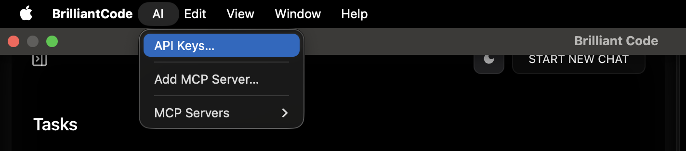
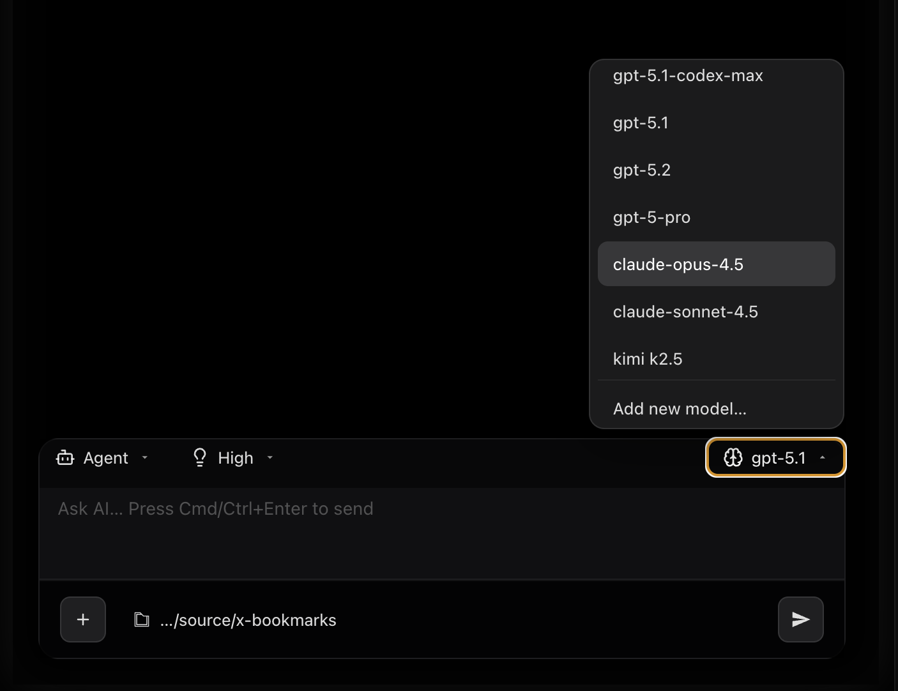
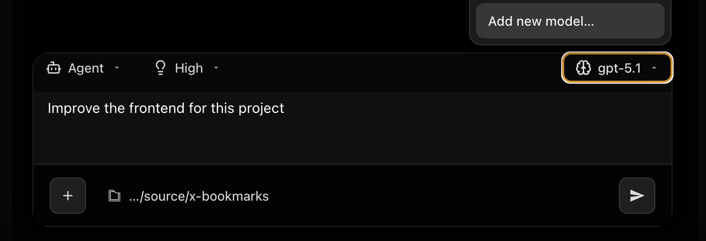
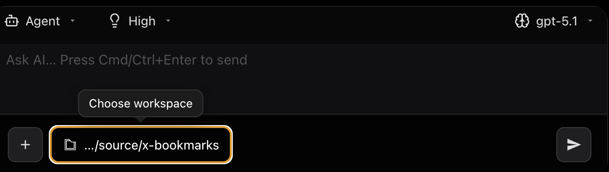
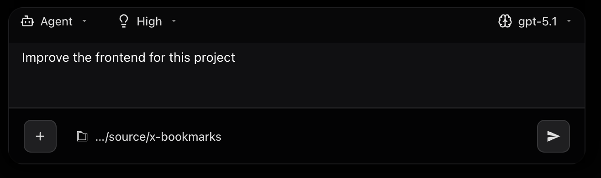

### BrilliantCode - Your open source AI engineer

BrilliantCode is an open-source agentic IDE that enables frontier models (including open source models) to build projects for you autonomously. Inside BrilliantCode, an LLM can spin up terminals, control a browser and create/edit files the same way you can as a dev. Transparency and control for human devs and agency for LLMs.

## Getting started

1. Download the app
    https://jcumoke.com/bcode#download

2. Add your API Keys.
	1. Go to AI -> API Keys 
		

3. Select a model
	1. 
	2. You can also add custom models
		

4. Create a project or open an existing project
   

5. Tell the agent want to do.
  
  
## Documentation

Read the documentation to learn more about how BrilliantCode works under the hood:

[Documentation](DOCS.md)
